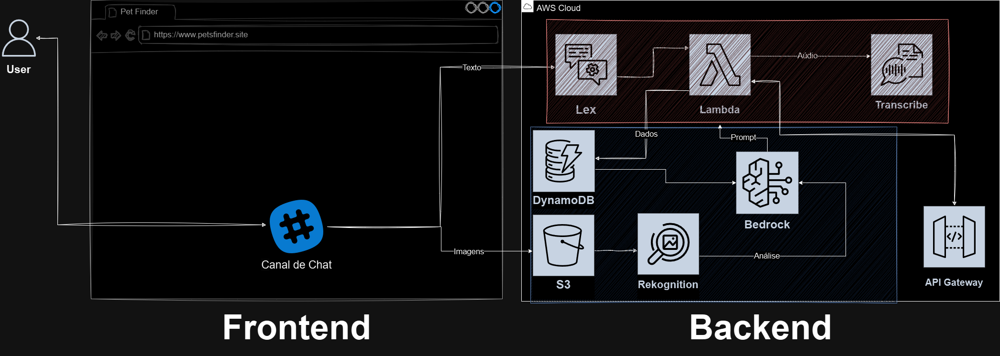
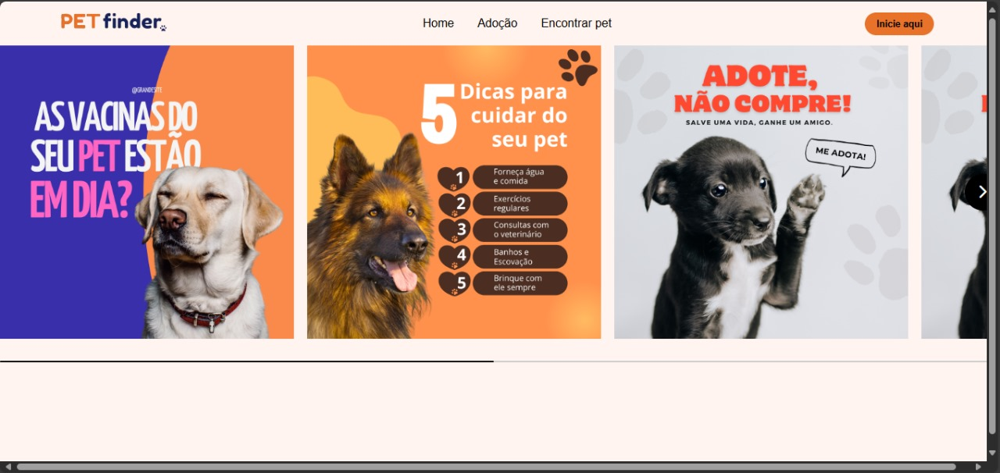
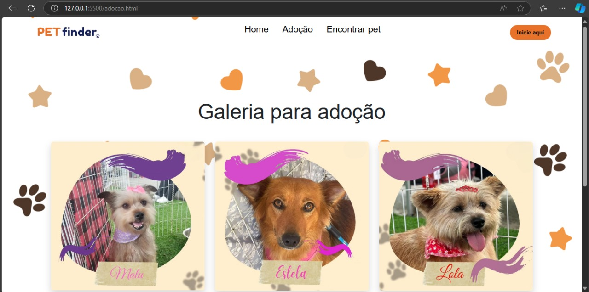
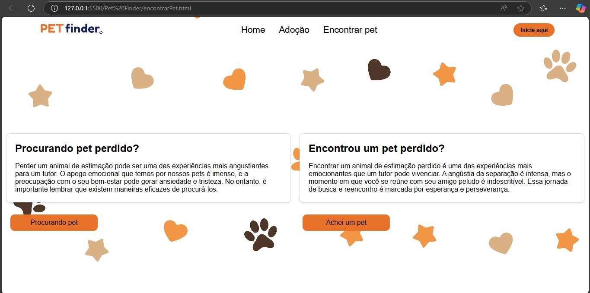
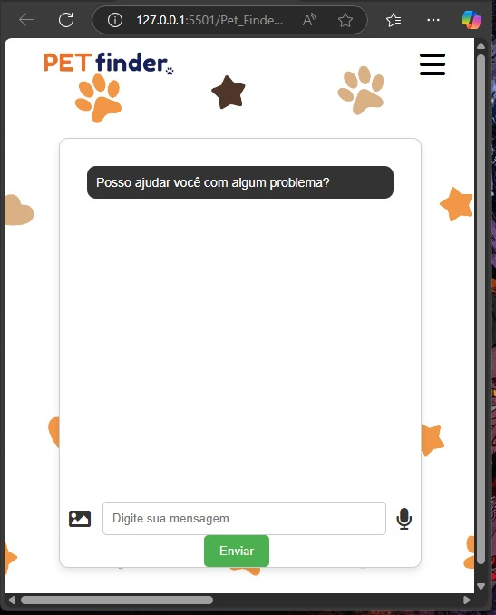

# <p align="center"> 🐾 Pet Finder 🐾

## ⚙️ Version

The current release is **Version 1.0**, launched in November 2024.

## 📝 Project Description

**Pet Finder** is a platform designed to connect animal shelters, NGOs, and individuals interested in adopting pets responsibly or reuniting with lost pets. This application leverages advanced cloud technologies and AI solutions to provide a scalable, secure, and user-friendly experience.

## 🎯 Project Features

The project is divided into two main phases:

#### Responsible Adoption:
- Facilitates the connection between institutions and individuals interested in adopting pets responsibly.
- Employs **Amazon Lex** in a chatbot to gather user preferences.
- Matches users with available pets based on the collected information and provides tailored recommendations.
- Uses **AWS Bedrock** to generate care tips and best practices for the suggested pet type.

#### Lost Pet Search:
- Allows users to upload an image of a lost pet, which is analyzed using **AWS Rekognition** to find similar pets in the system.
- Identifies the breed of the pet if detected.
- Integrates **Amazon Lex** to gather details about the lost pet.
- Links users to images and information of pets with similar characteristics in the database and connects them with relevant institutions.

## ⚙️ Technologies Used
<p align="center">
  <a href="https://go-skill-icons.vercel.app/">
    
  </a>
</p>

- **VSCode**: IDE used to write, edit, and debug the project code.
- **Python**: Programming language for backend logic and API development.
- **Node.js**: Used to develop the server-side application for managing endpoints and API integrations.
- **HTML & CSS**: For styling and creating the user interface.
- **JavaScript**: Used for frontend validation and additional functionalities.
- **Serverless Framework**: Facilitates the deployment of AWS Lambda functions without managing servers.
- **AWS Rekognition**: For image analysis and pet identification.
- **AWS Bedrock**: Generates AI-based text, such as care tips for identified pets.
- **Amazon Transcribe**: Enables users to interact with the chatbot via voice commands.
- **Amazon S3**: Stores images uploaded by users for analysis.
- **AWS DynamoDB**: NoSQL database for storing and retrieving pet data efficiently.
- **AWS IAM**: Manages credentials and permissions securely across AWS services.
- **Git & GitHub**: For version control and collaborative development.
- **Postman**: To test API routes and application functionality.
- **Docker**: Containerization for consistent deployment environments.
- **NGINX**: For hosting the application on an EC2 instance with SSL support.

## ⚙️ AWS Architecture Diagram:


## 🛠 How to Open and Run This Project

1. **Clone the repository**:
   ```
   git clone https://github.com/JeanPTBR/Pet-Finder.git
   ```

2. **Open the cloned repository in an IDE of your choice, such as VSCode**.

3. **Set up a virtual environment to avoid version conflicts**:
   ```
   python -m venv venv
   .\venv\Scripts\activate
   ```

4. **Install the Serverless Framework**:
   ```
   npm install -g serverless
   ```

5. **Configure AWS credentials**:
   ```
   aws configure
   ```

6. **Install dependencies**:
   ```
   npm install
   pip install -r requirements.txt
   ```

7. **Set environment variables**:
   Create a `.env` file with:
   - `S3_BUCKET`
   - `BOT_ALIAS_ID`
   - `BOT_ID`

8. **Deploy the application**:
   ```
   task deploy
   ```

9. **Test the endpoints**:
   Use Postman or a browser to interact with the API endpoints.

##  🌟 Features in Action:

- **Homepage**: Provides general information about pet care and adoption.


- **Gallery**: Displays images of pets available for adoption.


- **Lost Pet Search**: Allows users to upload an image of a lost pet and interact with the chatbot to find matches.


- **Chatbot**: Facilitates all interactions for both adoption and lost pet features.



## 🐋 Docker Deployment

1. **Build the Docker image**:
   ```
   docker build -t pet-finder -f Dockerfile .
   ```

2. **Run the container locally**:
   ```
   docker run -p 5000:5000 -v %USERPROFILE%/.aws:/root/.aws --env-file ../.env pet-finder-teste
   ```

## 🌐 EC2 Deployment with NGINX

The application is hosted on an EC2 instance, secured with SSL.


## 📂 Project Structure:

```
Project/                            
├── assets/                                                          
│
├── Pet_Finder/  
│   ├── public/                                     
│       ├── assets/
│       ├── css/
│       ├── html/
│       ├── js/
│   ├── Dockerfile
│   ├── server.js
│
├── Pet_Finder_API/                   
│   ├── aws/                                  
│       ├── dynamodb/                         
│       ├── lex/
│       ├── rekognition/
│       ├── transcribe/
│   ├── collections/
│   ├── serverless.yml
│
├── tasks/
│
├── .gitignore                                      
├── LICENSE                                    
├── local.env    
├── package.json
├── pyproject.toml                                  
├── README.md                                      
├── requirements.txt
```

## 🌐 Team:
Developed by:
 | [<br><sub>Jean Carlos</sub>](https://github.com/JeanPTBR) | [<br><sub>Moniza Oliveira</sub>](https://github.com/MONIZA-OLIVEIRA) | [<br><sub>Hugo Susini</sub>](https://github.com/hsusini) | [<br><sub>John Sousa</sub>](https://github.com/johnSousa23) | [<br><sub>Victor Sousa</sub>](https://github.com/souiuri)
| :---: | :---: | :---: | :---: | :---: |

